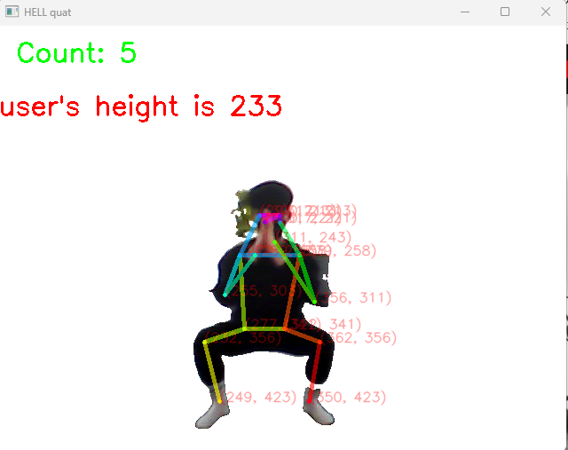
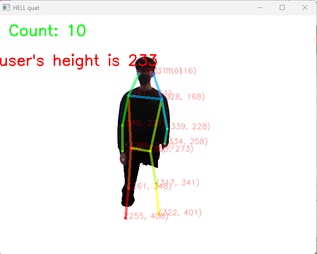

# Project name

* (간략히 전체 프로젝트를 설명하고, 최종 목표가 무엇인지에 대해 기술)
스쿼트 카운터
1.웹캠으로 실시간으로 영상을 받아와 포즈 추정 AI를 사용하여 스쿼트를 할때마다 카운트를하고
2.실시간으로 화면의 백그라운드를 제거해 사용자의 몸만 보이게 한다
3.스쿼트의 갯수를 화면에 표시한다.


## Requirement

* (프로젝트를 실행시키기 위한 최소 requirement들에 대해 기술)
CPU:	Intel(R) Core(TM) i7-9700 CPU @ 3.00GHz
memory:	32.0GB
GPU:Intel(R) UHD Graphics 630


## Clone code

* (Code clone 방법에 대해서 기술)

```shell
git clone https://github.com/desafin/intel_AI_squat_counter
```

## Prerequite

* (프로잭트를 실행하기 위해 필요한 dependencies 및 configuration들이 있다면, 설치 및 설정방법에 대해 기술)


```shell
pip install -r requirements.txt
```


## Steps to run

main.py 를 실행하기


## Output




## Appendix

* (참고 자료 및 알아두어야할 사항들 기술)
